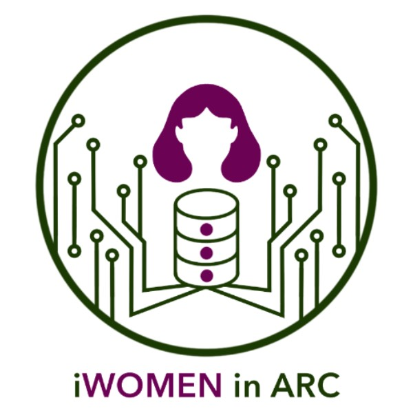

  

# iWOMEN in ARC: International Women in Advanced Research Computing

Improving accessibility and awareness to Advanced Research Computing (ARC) and Research Data Management (RDM) for International Women Students Engaged Research in Montréal.

# Empowering International Women in Academia: Addressing Barriers to Research Resources and Inclusion 

The complexity of academic and administrative systems can be challenging for international students. This includes accessing research tools provided independently from their institutions. Additionally, they often encounter barriers such as language difficulties, cultural differences, and gender bias, which can limit their access to mentorship and resources. By providing awareness and access to Digital Research Infrastructure (DRI) from Alliance Canada, this project seeks to create safe learning spaces, enhance resource accessibility, and support the academic and career development of this equity-seeking group, fostering diverse perspectives and innovations in their research fields. Ensuring that international women students engaged in research have access to HPC is essential for fostering diverse perspectives.

## Vision 
To create an inclusive academic environment where international women in academia have equitable access to Advanced Research Computing (ARC) and Research Data Management (RDM) resources, empowering them to thrive in their research and careers.

## Mission
To improve access to research resources for international women students in academia by providing education, training, and support in Advanced Research Computing (ARC) and Research Data Management (RDM).

## Contributors
### Project Leader
- Laura Carolina Camelo Valera**
  
### Collaborators from McGill Initiative in Computational Medicine (MiCM) 
- Meghana Munipalle**

**These participants are part of Alliance Canada program [Champions of the Equity, Diversity and Inclusion](https://alliancecan.ca/fr/initiatives/investissements-irn)

### Mentors 
- Georgette Femerling Romero
- Sana Naderi
- Xianglin Zhao

## Roadmap and Milestones
### Goals
- **Increasing Outreach and Awareness:** Develop outreach programs to inform international women students about the availability and benefits of using HPC in their research project.
- **Enhancing Accessibility through mentorship and training:** Provide technical and non-technical support to help international women students effectively use HPC resources.
- **Building inclusive communities:** Foster an inclusive environment through mentorship, community building, and collaboration opportunities.

### Outcomes
- Assessing Needs: Conduct a survey to understand the awareness and needs of international women students regarding HPC resources.
- Mentor Recruitment: Recruit mentors to support international women students in the program.
- Information Distribution: Develop and distribute multilingual materials through university channels, social media, and student-led organizations.
- Training Resources: Create and share multilingual training materials (guides, slides) on platforms like Slack, GitHub, and Email.
- Workshops and Events: Organize monthly workshops on ARC and RDM and hold two small social events.
- Networking Event: Host a closure and networking event to wrap up the program and foster future collaborations.

ANY international student in Canada is welcomed to reach out either if they are interested in being mentees or mentors. 
This project is funded by the Digital Research Alliance of Canada. For further questions, please contact Laura Carolina Camelo Valera (she/her, MSc) at laura.camelovalera@mail.mcgill.ca.
